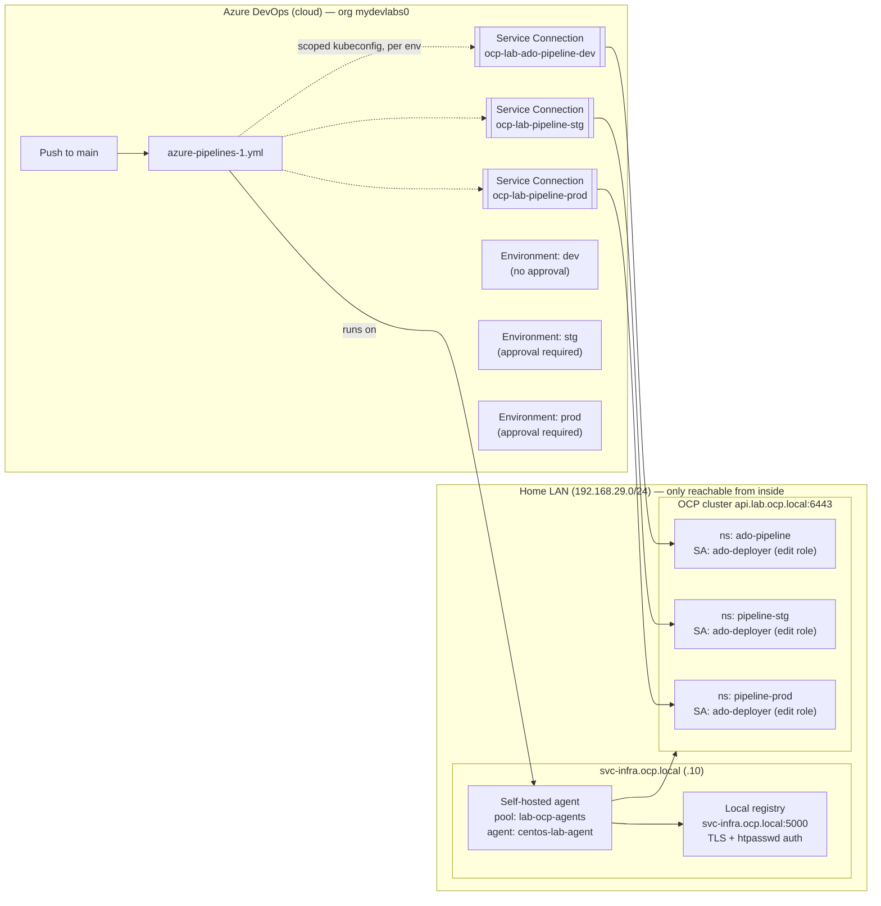
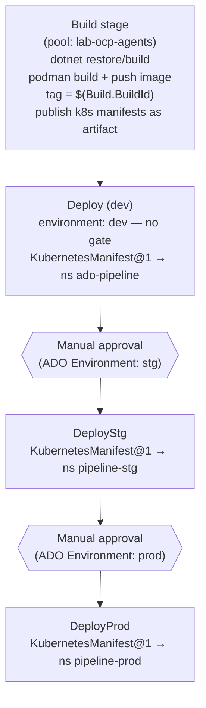

# High-Level Design — ADO → OCP CI/CD for `pipeline-dotNet`

Quick-reference architecture for the Azure DevOps pipeline that builds and
promotes `pipeline-dotNet` through `dev` → `stg` → `prod` on the
`lab.ocp.local` OpenShift cluster. For step-by-step commands, see
[LLD.md](./LLD.md); for the original walkthrough with rationale for each
decision, see [ocp-environment-setup.md](./ocp-environment-setup.md).

## 1. Why this design

Both the OCP API server (`api.lab.ocp.local:6443`) and the local container
registry (`svc-infra.ocp.local:5000`) only exist inside the home LAN — they
have no public DNS or routable address. That single constraint drives most
of the architecture:

- **Microsoft-hosted ADO agents can't be used at all** (they run in Azure's
  cloud with no route to the LAN) → a **self-hosted agent** runs on
  `svc-infra` instead, for every stage.
- **ADO's own cloud backend can't verify the Kubernetes service
  connections** at creation time (same reachability problem) → "Verify
  connection" is deliberately unchecked when creating them; the connection
  still works at run time because the self-hosted agent, not ADO's backend,
  is what actually calls the cluster.

## 2. Component overview

## 3. Pipeline stage flow

The **same image tag** built once in the Build stage is promoted through
all three environments — nothing is rebuilt per environment. This
guarantees stg/prod run the exact artifact that passed dev.

## 4. Trust and identity model

| Concern | Mechanism |
|---|---|
| Pipeline → cluster auth | One `ado-deployer` ServiceAccount **per namespace**, each bound to the `edit` ClusterRole via a namespace-scoped `RoleBinding` (never `ClusterRoleBinding`) — dev's SA cannot touch stg or prod, and vice versa. |
| Pipeline → registry auth | The self-hosted agent runs as the `centos` OS user on svc-infra, which already has `podman login` credentials cached (`~/.config/containers/auth.json`) and the registry's CA trusted (`/etc/containers/certs.d/svc-infra.ocp.local:5000/ca.crt`). No registry credentials live in ADO or in the pipeline YAML at all. |
| Cluster → registry pull auth | A cluster-wide global pull secret (`openshift-config/pull-secret`) already includes `svc-infra.ocp.local:5000`, so every namespace's default service account can pull images without a per-namespace image pull secret. |
| Change control | ADO Environments `stg` and `prod` each carry an **Approvals** check; `dev` has none. A pipeline run pauses automatically at the `DeployStg` and `DeployProd` stages until a designated approver signs off. |

## 5. Key design decisions (best practices)

- **Least privilege, per-namespace scope** — see table above.
- **No shared credentials across environments** — separate SA, token,
  kubeconfig, and ADO service connection per environment.
- **Credentials never committed to git** — enforced by `.gitignore`
  (`*.kubeconfig`, `*-ca.crt`, `*.token`, `*.pem`, `*.key`,
  `users.htpasswd`); kubeconfigs live only in `~/POCs/pipeline/ado-secrets`
  on svc-infra (`chmod 700`/`600`) and are pasted directly into the ADO
  service-connection UI.
- **Immutable image promotion** — deploy manifests reference
  `$(imageRepo):$(imageTag)` (the build id), never `:latest`; `latest` is
  pushed only for convenience browsing of the registry.
- **Namespace-agnostic k8s manifests** — `Deployment`/`Service` YAML carry
  no hardcoded `namespace:` field, so the same files apply cleanly to all
  three namespaces; the target is supplied per-stage via the
  `KubernetesManifest@1` task's `namespace` input.
- **OpenShift arbitrary-UID compatibility** — the container image is
  hardened (`chmod g=u /app`, `HOME=/tmp`) so ASP.NET Core's
  DataProtection key storage works under OpenShift's restricted SCC, which
  assigns a random non-root UID at runtime rather than running as root.
- **Manual, deliberate prod changes** — RBAC/token creation for
  `pipeline-prod` is treated as a protected action requiring a human to
  run the command directly, not scripted across environments in one shot.
- **Per-pipeline service-connection authorization** — "Grant access
  permission to all pipelines" is left unchecked on every service
  connection.
